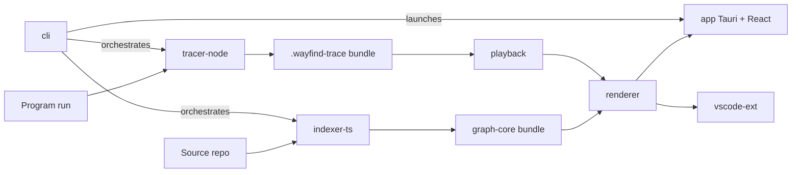

# Wayfind — Architecture

How the system is put together and why. Contested decisions have ADRs in [adr/](adr/).

## 1. Overview

Wayfind is two pipelines feeding one renderer:

- **Static pipeline:** source code → language indexer → **code graph** (structure).
- **Dynamic pipeline:** program run → language tracer → **trace** (behavior).

The renderer draws the graph as a zoomable map; playback replays a trace *on top of* that map. Everything between the adapters and the screen is language-agnostic.

## 2. Packages

| Package | Responsibility | Depends on |
|---|---|---|
| `graph-core` | Code-graph schema (nodes: module/class/fn/block; edges: import/call/inherit/flow), Zod-validated, independently versioned. Pure data + validation, no I/O. | — |
| `trace-format` | `.wayfind-trace` spec: event stream (enter/exit/branch/assign/throw), value snapshots, source spans. Columnar + compressed. Reader/writer only. | `graph-core` (span refs) |
| `indexer-ts` | TS/JS static analysis → graph-core (tree-sitter + TS compiler API). Incremental re-index on file change. | `graph-core` |
| `tracer-node` | Runtime tracer via V8 inspector protocol. User-code filtering, value sampling/size caps, redaction. | `trace-format` |
| `renderer` | WebGL/canvas map engine: semantic zoom, edge bundling, layout (ELK + custom), 60 fps on 50k-node graphs. Layout in a worker. | `graph-core` |
| `playback` | Trace loader, timeline model, state reconstruction at time *t*, exception-path computation. | `trace-format`, `graph-core` |
| `app` | Tauri desktop shell + shared React UI (map view, timeline, search, breadcrumbs, settings). | `renderer`, `playback` |
| `vscode-ext` | Focus sync (both directions), go-to-code, "record this test" lens. Reuses the same React UI in a webview. | `renderer`, `playback` |
| `cli` | `wayfind index / record / open / check`. npm package name: `wayfind` (so `npx wayfind open .` works). | all of the above |

`apps/docs` is the docs site plus a hosted live demo map of a well-known OSS repo (the marketing asset). `examples/` holds reference repos with committed indexes and traces used as golden tests.

**Dependency rule:** adapters (`indexer-*`, `tracer-*`) depend on format packages, never on UI. UI depends on format packages, never on adapters — the CLI is the only place both sides meet. This is what keeps new-language support additive.

## 3. Static pipeline

1. `cli` discovers project shape (tsconfig, package.json, workspace layout).
2. `indexer-ts` parses with tree-sitter (fast, error-tolerant) and resolves semantics with the TS compiler API (types, imports, call targets).
3. Emitted graph is validated against `graph-core` and written as a versioned bundle next to the repo (`.wayfind/`).
4. A file watcher triggers incremental re-index: only the changed file's subgraph and its edge neighborhood are recomputed (< 1 s budget).
5. Third-party packages become single boundary nodes — internals are never indexed (FR-IDX-3).

## 4. Dynamic pipeline

1. `wayfind record -- <command>` launches the target with `--inspect` and attaches `tracer-node`.
2. Debugger/instrumentation events are filtered to user code *at capture time* (cheapest place), sampled, size-capped, and redacted per config.
3. Events stream to disk in columnar chunks (append-only during recording; compressed and finalized on exit) — a crash mid-run still yields a readable partial trace.
4. The bundle records the repo commit + graph-format version so `playback` can detect index/trace mismatches (FR-PLAY-5).

## 5. Rendering & playback

- The renderer treats the graph like map tiles: each altitude has its own level-of-detail rules (which nodes exist, which labels show, how edges bundle). Zoom interpolates between them so transitions read as continuous.
- Layout runs off-thread (worker); the main thread only interpolates positions. Layout results are cached in the graph bundle so reopening a repo is instant.
- `playback` reconstructs "state at time *t*" from the event stream plus periodic snapshots — scrubbing backwards is as cheap as forwards.
- Performance budgets (index < 30 s/100k LOC, incremental < 1 s, 60 fps at 50k nodes, trace overhead < 5×) are CI-enforced from M2 onward. **Performance is the product** — a budget regression blocks merge.

## 6. Key decisions (ADR index)

| ADR | Decision |
|---|---|
| [0001](adr/0001-license-apache-2.0.md) | Apache-2.0 over GPL-3.0 |
| [0002](adr/0002-monorepo-tooling.md) | pnpm workspaces + turborepo monorepo |
| [0003](adr/0003-renderer-webgl.md) | WebGL renderer from day one |
| [0004](adr/0004-language-adapter-contract.md) | Languages as adapter pairs against versioned format specs |

## 7. Open questions (need ADRs before their milestone)

- Graph bundle storage: flat JSON vs SQLite for 1M+ node repos (decide during M1, revisit at scale).
- Layout engine: how much ELK vs custom force/constraint hybrid (M2).
- Trace chunk compression codec and snapshot cadence (M4).
- Webview vs native rendering split for the VS Code extension (M3).
