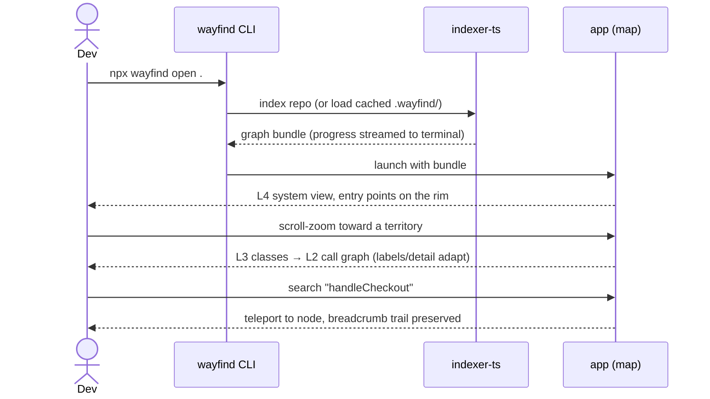
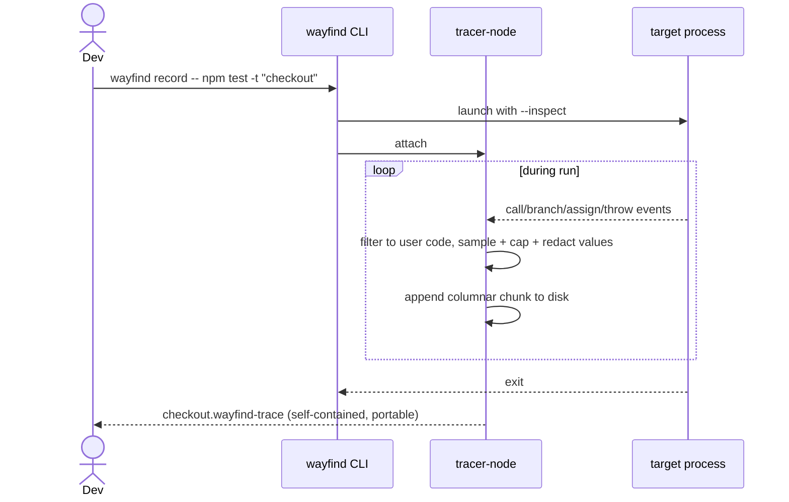
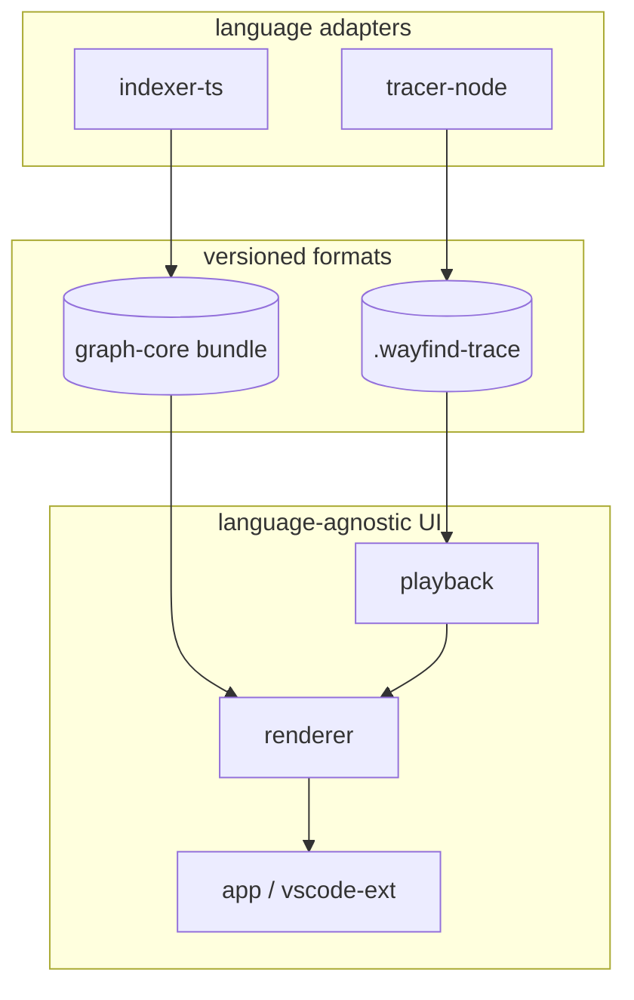

# Wayfind — User & Data Flows

The core loops the product must nail. UI states reference altitudes L4–L1 (see [REQUIREMENTS.md](REQUIREMENTS.md) §2.2).

## F1 — Open & orient (the first 2 minutes)

Success = the developer can answer "what are the main parts and where does execution enter" without reading a file.

## F2 — Record a run

## F3 — Playback (execution cinema)

1. `wayfind open checkout.wayfind-trace` — playback verifies the trace's commit/format against the loaded index; mismatch → clear warning, not silent wrongness.
2. Timeline scrubber appears under the map. Play/pause, speed control, step, jump-to-event.
3. As time advances: active block glows, calls animate along edges, values pop onto edges at the moment they change.
4. Click any node at any timestamp → inspector panel shows full captured local state at that moment (time travel).
5. An uncaught exception renders as a rupture at the exact block; the propagation path up the call stack is highlighted. Jumping to it is one click from anywhere on the timeline.
6. Collapsed dependency nodes show only boundary data: "→ into `lodash.merge`, ← returned `{...}` in 0.3 ms".

## F4 — Bidirectional go-to-code

| Direction | Trigger | Result |
|---|---|---|
| Map → editor | double-click node / "go to code" | VS Code opens exact `file:line`, line flashes |
| Editor → map | cursor moves (debounced) | map pans/zooms to enclosing node, highlights it |
| Trace → editor | select a timeline range | executed source lines highlighted in gutter |
| Editor → trace | "record this test" lens (M-post) | records and opens F3 directly |

The extension and app share one core; sync messages go over a local socket when both are open.

## F5 — Share a trace

1. Record locally (F2). 2. Inspect/redact (`wayfind trace inspect` planned). 3. Attach the `.wayfind-trace` file to a PR/bug/onboarding doc. 4. Recipient runs `wayfind open <file>` — same cinema, their machine, no cloud. Sensitivity rules: [SECURITY.md](../SECURITY.md).

## Data flow between packages

Adapters write formats; UI reads formats; nothing crosses otherwise. That boundary is the language-adapter contract ([ADR-0004](adr/0004-language-adapter-contract.md)).
